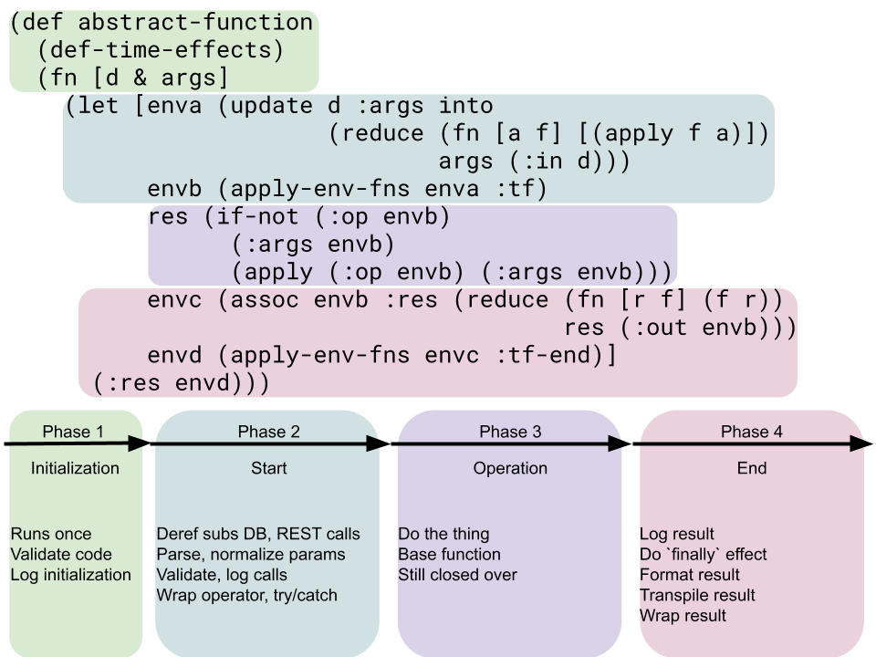

<div style="text-align: center;">

</div>

# ti-yong: Transforming the Substance of the Function

[**ti-yong**](https://en.wikipedia.org/wiki/Tiyong) (体 "body" + 用 "use")
> _is a compound of two terms: 'essence,' [ti] the absolute
reality, cause, or source of all things, and 'function,' [yong] the
manifestations of ti, which make up the impermanent and relative concrete
reality. Ti and yong do not represent two separate things, but aspects of the
same [non-dual](https://en.wikipedia.org/wiki/Nondualism) process._

## What is a Transformer?

`transformers` provide a powerful, new approach to code reusability by
decomposing functions into data structures that can be manipulated at runtime.
They allow you to define functions as transformations over data, enabling you
to easily compose and share implementation logic.

## Problem

Code reusability is a common challenge in software development. Clojure's
"lego" strategy of implementation reuse, which emphasizes small, modular
functions, helps to some extent. However, we still have some problems with data
hiding behind closures and difficulties with changing deeply nested hierarchies
of functions quickly.

## Solution

Transformers address these challenges by treating functions as data and
providing a way to decompose and declare them as transformations over that
data. By explicitly defining functions as transformations, you gain the ability
to compose and share implementation logic in a flexible and maintainable way.

## Key Features

- **Code Reusability**: Transformers enable you to share implementation logic
between functions, reducing code duplication and technical debt.
- **Data-Oriented Approach**: By decomposing functions into data structures,
Transformers leverage Clojure's sequence and associative transformation tools
to manipulate and transform functions at runtime.
- **Flexible Composition**: With Transformers, you can easily compose functions
and define new functions that inherit behaviors from existing ones. This allows
for easy customization and adaptation of functionality.
- **Immutable and Functional**: Transformers follow the principles of
immutability and functional programming, ensuring predictable and reliable
behavior.

NOTE: This library is alpha and subject to breaking changes. At a future point,
there will be a non-alpha stable version of this library.

## Getting Started

To use Transformers in your Clojure project, simply add the following
dependency to your `deps.edn` file:

```clojure
{:deps {#_...
         johnmn3/ti-yong {:git/url "https://github.com/johnmn3/ti-yong"
                          :sha "sha-here"}
        #_...}}
```

### A Simple Example

```clojure
(ns my.numbers.api
  (:require
   [ti-yong.alpha.transformer :refer [transformer]]))

(def add
  (-> transformer
      (assoc :op +)))

(add 2 2) ;=> 4

(def add-and-inc
  (-> add
      (update :out conj ::add-and-inc inc)))

(add-and-inc 2 2) ;=> 5
```

A more involved example, somewhere deep in a TodoMVC app:
```clojure
(def filter-anchor
  (-> comp/a
      (update :id conj ::filter-anchor)
      (update :with conj a/selected? a/void-todo styled/filter-anchor)
      (assoc-in [:props :on-selected]
                #(-> % (assoc-in [:style :border-color]
                                 "rgba(175, 47, 47, 0.2)")))))

(def filter-all
  (-> filter-anchor
      (update :id conj :all)
      (update :children conj "All")))

(def filter-active
  (-> filter-anchor
      (update :id conj :active)
      (update :children conj "Active")))

(def filter-done
  (-> filter-anchor
      (update :id conj :done)
      (update :children conj "Completed")))
```

## Rationale

Some say that [closures are just objects of one method](https://wiki.c2.com/?ClosuresAndObjectsAreEquivalent).
Transformers give Clojurists some of the benefits of "Object Orientation"
without many of the downsides Clojurists dislike about objects.

- Objects couple behaviors required from multiple callers into a single class,
while Transformers do not change existing behaviors for existing callers by
default

- Objects push inheritance first design, whereas a transformer's inheritance is
a function of shared structure between Clojure data structures derived from one
another and design is driven by concrete implementation needs, like regular
Clojure

- Objects couple state and methods in spaghetti ways and Transformers are just
immutable maps. And just like how Clojure lets you stash stateful things like
atoms in functions, Transformers allow you to build stateful Transformers, but
like Clojure the default convention is to do everything immutably

- Objects try to provide data hiding as a function of encapsulation whereas
Transformers are doing the opposite, exposing data otherwise hidden by a
closure

Expand this summary to get a little deeper into the discussion around this
problem at a high level:

<details closed>
  <summary>A high level summary of the problem</summary>

Suppose we have the following function composition tree:
```
                         A      
                         |      
                         B      
                         |      
                         C      
                       /   \    
                     D       E  
                   /  \     /|\ 
                 F     G  H  | I
                        \/  / / 
                         J_/_/  
                         |      
                         K      
```
Now, suppose we want a new function called L that wraps K. However, this new L
function needs slightly different behavior in the way that C works.

We can easily create a new C (say, "C2") that has the new behavior, but the new
L also needs all the additional behaviors from D, E, F, G, H, I, J and K.

So, they all need to be recomposed into a new tree. So now our implementation
graph looks like this:
```
                         A                           
                         |                           
                         B_________________          
                         |                 \         
                         C1                 C2       
                       /    \             /    \     
                     D       E          D       E    
                   /  \     / |\         \     / |\  
                 F     G  H   | I         G  H   | I 
                        \/   /  /          \/   /  / 
                         J__/__/            J__/__/  
                         |                  |        
                         K1                 K2       
```
Notice, the only genuinely new code in the new tree is in C2 and K2.

D, E, F, G, H, I and J all needed to be recomposed into two separate
call trees, bloating code with technical debt. If there's ever a bug in the way
G called D, for instance, we'll now have to remember to go back and fix it in
two different places.

Looking at the graph like this, we might get the impression that managing this
code duplication isn't that bad. Visually, you can _see_ where the duplications
are and if you later want to replace the common code with an abstraction, it
looks like that would be pretty easy. But when these functions are spread
across many namespaces, with even deeper call trees, with more numerous
duplications through out the app, over the course of years...

No, sometimes it's not entirely clear whether or not these two call trees can
be abstracted back into one again. So, what started as a defensive measure, to
grow our code rather than changing it, duplicating it created it's own set of
problems and technical debt for us to deal with.

With Transformers we are able to define C2 and K2 and then share the rest of
the call tree between C and K.
```
                                    A        
                                    |        
                                    B        
                                    |        
                                    C  C2    
                                  /  \/|     
                                D____/\E     
                               / \    /|\    
                              F   G  H | I   
                                   \/ / /    
                                    J/_/     
                                    | \      
                                    K  k2    
```
We are not _mutating_ here. When K2 is defined, two different _logical_ call
trees are created, similar to how `(def a {:a 1})` and `(def b (assoc a :b 1)`
are two different logical maps that share implementation structure between
them.

Imagine if we weren't allowed to `(def c (assoc b :a 3))` because the value of
`:a` was already closed over by the definition of `a` and `b`. We'd end up
having to redefine a lot of values for a lot of things that mostly already
exist but just happen to be in different data structures simultaneously.

So, why do that to ourselves with our functions?

We're good at managing sequences and eloquently merging maps. It's trivial for
us to simply decompose our functions into data and declare them as
transformations over those decomposed pieces. Transformers let us do that.

With Transformers you can transform your functions like data. By explicitly
decomposing and declaring your functions as data, and by defining them via
transformations over data, regular functions gain macro-like powers over
other regular functions defined in this way.

So don't wait... Embrace the _non-dual_ nature of data function Transformers.
Yes, even you, too, can walk through the _vail of the closure_ and finally tame
the `ti-yong` dragons of duality between verbs and nouns!
</details>

#### Transformers From the Ground Up

Expand the section below to go into a more detailed example of the problem and
the solution built using basic functions and data.

<details closed>
  <summary>Example of the problem and building Transformers from the ground up</summary>

Bob works at Acme Widgets as a Staff Engineer in the Weather Widgets
department.

They've got'im working on a widget that converts celcius to fahrenheit.
Pretty simple, right? Should have been, but... management... They thought
they were better programmers than Bob.

Bob warned them, "I need more requirements. It can't just be
`(* (/ 5 9) (- c 32))` from spreadsheet you gave me. How will it be used?"

"No, it's just that!" they said. "It'll be easy," they said. "Fine," he
said.
```clojure
(defn fahrenheit [c]
  (* (/ 5 9) (- c 32)))
#_(fahrenheit 104) ;=> 40
```
A week after the widget hit prod though, here they come:

"Bob, we need it to recognize numbers ending in c, Bob," they said. "It's
just thas one more thing," they said. "Oh, and the output needs an f at the
end," they also said.

By this time, though, the fahrenheit component had been added to twelve
different weather components, spread across other components in 37 different
namespaces, which has already been showing up in hundreds of pages through
out multiple apps running in prod. Changing fahreinheit now is not a trivial
thing. It'll take tons of testing across many different teams that depend on
how it currently looks and works.

So Bob did the logical thing and just wrapped it:
```clojure
(defn parse-c [c]
  (if (= \c (last (str c)))
    (parse-long (apply str (butlast (str c))))
    (if (string? c)
      (parse-long c)
      c)))
#_(parse-c "104c") ;=> 104

(defn f2 [c]
  (let [c2 (parse-c c)]
    (str (fahrenheit c2) "f")))
#_(f2 "104c") ;=> "40f"
```
#### _Implementation diagram so far:_
```clojure
;; fahrenheit    parse-c    
;;           \  /           
;;            f2            
```

There. Now all existing callers can continue to function and look as they
are and only new widgets that the higherups need the new behavior in can
depend on the newly wrapped function. That's normally how we reuse
implementation details in functional programming - we wrap it in another
function. This is called the "legos method" of code reuse.

But, uh oh, the higherups came back with another request...
They wanted Bob to peg all inputs below 0 to 0 now. They say it's for
simplified widgets view, for views that don't involve temperatures below
zero celsius.

"Fine, whatever," Bob thinks. "I'm done trying to reason with these
people."

Against Bob's better judgement, he went and made the thing that can't
calculate temperature correctly. But now he had a problem.

In the time between their previous request and this one, both the original
farenheit and the f2 versions of the calculator have ended up in twice as
many namespaces and web pages in prod. So, if we need to change how either
one of those work, we're going to need to test all of those downstream apps
very thoroughly.

Can't we just do what we did last time? Can't we just wrap f2 like we did
with fahreinheit? Then only have new callers are calling the feature-wrapped
versions?

"No," Bob realized. We need the parser to run before we can compare the
input to 0. We don't need to change the value of f2's input (c) or its
return value - we need to alter a value inside of f2 (c2).

So, sure, he can defensively make a f3 but, unfortunately, Bob's going to
have to reimplement most of c2 in his new f3 function. So that's what he
did:
```clojure
(defn f3 [c]
  (let [c2 (parse-c c)]
    (if (< c2 0)
      (str (fahrenheit 0) "f")
      (str (fahrenheit c2) "f"))))
#_(f3 "-19") ;=> "-17.77777777777778f"
#_(f3 "-30") ;=> "-17.77777777777778f"
```
#### _Implementation diagram so far:_
```clojure
;; fahrenheit-1  parse-c-1   fahrenheit-1  parse-c-1    
;;           \  /                      \  /             
;;            f2                        f3              
```
There we go. That looks great! But like all great things, management came
back with another request. They say that some customers say that they only
want even significand (to the left of the decimal) outputs, otherwise they'd
like to have 1 added to the output.

Weird flex, but okay, right? Things stopped making sense a long time ago, as
far as Bob was concerned. Again, since our new f3 has been created, Terry
has added 23 widgets that depend on it. And, again, we don't need to risk
breaking those downstream consumers of f3, so Bob can just make an f3-even,
for those widgets that need the new feature.

All is not lost though, right? We can still reuse all of the implementation
from f3, right? No, f3 returns strings... We'd have to either turn the
strings back into numbers, so that we can add 1 to the even numbers, or we'd
have to reimplement f3 entirely. Dang it!

"Fine," Bob surmises, "Clojure makes this super easy anyway." And he's right.
These  functions are very simple and not hard to understand. It looks a
little messy, but it's a mess we can handle. It is far better to defensively
grow our code and risk implementation redundancy and code duplication than
it is to change existing code and risk breaking the whole world of
downstream consumers.

So, again, he again reimplements a bespoke solution, very similar to
existing solutions, but just slightly different:
```clojure
(defn f3-even [c]
  (let [c2 (parse-c c)
        res (if (< c2 0)
              (fahrenheit 0)
              (fahrenheit c2))]
    (str (if (even? (int res))
           res
           (inc res))
         "f")))
#_(f3-even "50") ;=> 10
#_(f3-even "51") ;=> 10.555555555555555
#_(f3-even "52") ;=> 12.11111111111111
```
#### _Implementation diagram so far:_
```clojure
;; fahrenheit    parse-c     fahrenheit    parse-c     fahrenheit    parse-c    
;;           \  /                      \  /                      \  /           
;;            f2                        f3                        f3-even       
```
Not pretty, but whatever, this is a one off. It's a pure function. It does
what it needs to, let's just leave alone and stop talking about it, k?

Fortunately, because everything is so stable and Acme Widgets has this ethic
of always defensively duplicating code over risking the breakage of
downstream callers in important components, Bob is right. He can mostly set
it and forget it and it'll keep working 100 years from now.

Oh, suprise, suprise... Now the higherups have a new requirement: fahrenheit
is going multi tenent. I know, it sounds drastic but we can migrate
incrementally.

One of our premium customers wants to be able to put capital "C"s, in
addition to lowercase "c"s, for inputs. The higherups think it'd be a great
idea if, as a test, we introduce multi-tenancy first in our weather widgets
and, specifically, in Bob's farenheit widgets. If non-premium customers want
that feature, they'll have to pay extra.

Bob would prefer not to support duplicative code over time unnecessarily, so
he reuses parse-c's implementation in parse-C. The new behavior can wrap
the semantics of parse-c cleanly, so no big deal:
```clojure
(defn parse-C [c]
  (if (= \C (last (str c)))
    (parse-long (apply str (butlast (str c))))
    (parse-c c)))
```
parse-c was implemented way back before f2 was implemented though. Do we
have to make a new f2? And do we also have to make a new f3, so that we
can have a new f3-even?

Bob ponders parameterizing the parser. Again, he sees no point in risking
damage to downstream callers of f3 and f3-even, so he implements fresh,
bespoke versions of f3 and f3-even with the parser parameterized:
```clojure
(defn f3-with-parser [c & [parser]]
  (let [c2 ((or parser parse-c) c)] ; <- let's still fall back to parse-c
    (if (< c2 0)
      (str (fahrenheit 0) "f")
      (str (fahrenheit c2) "f"))))
#_(f3-even-with-parser "104C" parse-C) ;=> "40f"

(defn f3-even-with-parser [c & [parser]]
  (let [c2 ((or parser parse-c) c)
        res (if (< c2 0)
              (fahrenheit 0)
              (fahrenheit c2))]
    (str (if (even? (int res))
           res
           (inc res))
         "f")))
#_(f3-even-with-parser "104C" parse-C) ;=> "40f"
```
#### _Implementation diagram so far:_
```clojure
;; fahrenheit    parse-c     fahrenheit    parse-c     fahrenheit    parse-c  
;;           \  /                      \  /                      \  /         
;;            f2                        f3                        f3-even     
;;                                                                            
;;                                                                            
;; fahrenheit----parse-c____               fahrenheit----parse-c              
;;           \  /           \                        \  /                     
;;      f3-with-parser       parse-C          f3-even-with-parser             
```
Awesome. A bit of a PITA, having to expand our signature like that, but
it's more robust now. Also sucks that we have to maintain the parallel
implementations like this. Maybe Bob should refactor this.

He'll get to that soon, but the higherups have another feature request
that has to get done quick. Remember that "never less than zero""
constraint from f3? Now they want to let prememium members have any number
less than "n" or any other condition, for that matter.

Okay, so what do we do now?

Can we wrap f3-with-parser? Again, no, because that conditional's logic
(`(< c2 0)`) is closed over, inside f2 and f3. And, again, Sally already
made 15 widgets that depend on them, living in prod. Dependencies have
already leaked everywhere for f3-with-parser and f3-even-with-parser.

We can't keep doing this. Bob needs to parameterize that conditional so we
can stop reimplementing it. Then we can start reusing these functions by
simply composing them with function wrappers that pass in the conditional
as a parameter.

And, we still don't want to unnecessarily risk affecting consumers of f2,
f3, f3-even, f3-with-parser and f3-even-with-parser, so let's not delete
those. Let's just make the new parameterized versions for new callers. One
day, when we have the resources, we may migrate all those old consumers to
the new functions. For now, we have to move fast without breaking things so
let's just have Bob make some new functions:
```clojure
(defn f3-with-parser-and-conditional [c & [parser conditional-fn]]
  (let [c2 ((or parser parse-c) c)] ; <- let's still fall back to parse-c
    (if conditional-fn
      (if (conditional-fn c2)
        (str (fahrenheit 0) "f")
        (str (fahrenheit c2) "f"))
      (if (< c2 0)
        (str (fahrenheit 0) "f")
        (str (fahrenheit c2) "f")))))

(defn f3-even-with-parser-and-conditional [c & [parser conditional-fn]]
  (let [c2 ((or parser parse-c) c)
        res (if conditional-fn
              (if (conditional-fn c2)
                (fahrenheit 0)
                (fahrenheit c2))
              (if (< c2 0)
                (fahrenheit 0)
                (fahrenheit c2)))]
    (str (if (even? (int res))
           res
           (inc res))
         "f")))
(f3-even-with-parser-and-conditional 104 parse-C #(< % 0)) ;=> "40f"
``` 
#### _Implementation diagram so far:_
```clojure
;; fahrenheit    parse-c     fahrenheit    parse-c     fahrenheit    parse-c       
;;           \  /                      \  /                      \  /              
;;            f2                        f3                        f3-even          
;;                                                                                 
;;                                                                                 
;; fahrenheit----parse-c________               fahrenheit----parse-c                   
;;           \  /               \                        \  /                          
;;            f3-with-parser     parse-C           f3-even-with-parser    
;;                                                                                 
;;                                                                                 
;; fahrenheit----parse-c                   fahrenheit----parse-c                     
;;           \  /                                    \  /                          
;;  f3-with-parser-and-conditional            f3-even-with-parser-and-conditional             
```
Okay, hmm. That's a bit much. There's gotta be a better way. Sure, we could
parameterize everything about this function, but where do we stop? This is
getting out of hand.

Just for shits-and-giggles, Bob decides to take this parameterization a step
further and parameterize even the even? branch of the second function. This
allows him to reduce both functions back down into a single function that
optionally defaults to the even? testing branch unless it's overridden by
the caller. So Bob makes an f4 that parameterizes what to do with the
conditional's result:
```clojure
(defn f4 [c & [parser conditional-fn dunzo]]
  (let [c2 ((or parser parse-c) c)
        res (if conditional-fn
              (if (conditional-fn c2)
                (fahrenheit 0)
                (fahrenheit c2))
              (if (< c2 0)
                (fahrenheit 0)
                (fahrenheit c2)))]
    (str (if dunzo
           (dunzo res)
           (if (even? (int res))
             res
             (inc res)))
         "f")))
#_ (f4 104 parse-C #(< 40 %) #(if (even? (int %)) % (inc %))) ;=> "-16.77777777777778f"
```
#### _Implementation diagram so far:_
```clojure
;; fahrenheit    parse-c     fahrenheit    parse-c     fahrenheit    parse-c       
;;           \  /                      \  /                      \  /              
;;            f2                        f3                        f3-even          
;;                                                                                 
;;                                                                                 
;; fahrenheit----parse-c________               fahrenheit---parse-c                   
;;           \  /               \                        \  /                          
;;            f3-with-parser     parse-C           f3-even-with-parser    
;;                                                                                 
;;                                                                                 
;; fahrenheit----parse-c                   fahrenheit----parse-c                 
;;           \  /                                    \  /                          
;;  f3-with-parser-and-conditional     f3-even-with-parser-and-conditional
;;                                                                                 
;;                                                                                 
;;                   fahrenheit----parse-c   
;;                             \  /          
;;                              f4   
```
Now we can do (f4 104 parse-C #(< 40 %) #(if (odd? (int %)) % (inc %)))
```clojure
(f4 104 parse-C #(< % 0) #(if (odd? (int %)) % (inc %))) ;=> "41f"
```
Okay, but this is getting pretty ugly now. The function is moreso
parameterization than it is business logic.

We're parameterizing the handling of the inputs. We're parameterizing what
to do with the inputs after they're handled. We're parameterizing almost
everything but the function that's actually operating on the data.

Why not parameterize that too? Why not parameterize everything about a
function?

Below is an "abstract function" which is structured into these internal
function stages that we've been discussing:
```clojure
(def data {:args [] :in [] :tf [] :op nil :out [] :tf-end [] :res nil})

(defn apply-env-fns [env k]
  (if-not (seq (get env k))
    env
    (reduce (fn [e f] (f e)) env (get env k))))

(defn abstract-function [d & args]
  (let [enva (update d :args into
                     (reduce (fn [a f] [(apply f a)])
                     args (:in d)))
        envb (apply-env-fns enva :tf)
        res (if-not ((:op envb))
                (:args envb)
                (apply (:op envb) (:args envb)))
        envc (assoc d :res (reduce (fn [r f] (f r))
                                   res (:out envb)))
        envd (apply-env-fns envc :tf-end)]
    (:res env4)))
#_ (abstract-function (-> data (assoc :op +)) 1 2 3) ;=> 6
```
Okay, so what we have here is a data model of a function. With it, we're able
to do everything we were able to do above, but with just data.

In the picture below, we break down this data model for functions into four
main phases:

<div style="text-align: center;">

</div>

In the picture we also have an initialization phase. We're not going to use the
initialization phase in this section but we'll get into them in other sections.

Okay, let's try it first with fahrenheit as the operator function:
```clojure
(->> 104
     (abstract-function (-> data (assoc :op fahrenheit)))) ;=> 40
```

Sure, that's not very useful by itself. The fun starts when we add more
implementation data to the abstract function.

Let's replicate f2 by adding parsing and formatting implementation data:
```clojure
(->> "-103c"
     (abstract-function
      (-> data
          (update :in conj parse-c)
          (assoc :op fahrenheit)
          (update :tf-end conj #(update % :res (str % "F")))))) ;=> -75
```
Why would we do this? By keeping these implementation details separate but
still located in the same data structure as its other associated implementation
details, we can _use_ the function or _reuse the implementation_ of the
function, depending on the evolving requirements of our application.

Let's define f2 again but, this time, lets store the function as data:
```clojure
(def f-with-parse ;; was f2
  (-> data
      (update :in conj parse-c)
      (assoc :op fahrenheit)
      (update :tf-end conj #(update % :res (str % "F")))))
```
#### _Implementation diagram so far:_
```clojure
;; fahrenheit    parse-c  
;;           \  /         
;;        f-with-parse    
```
So far, our implementation diagram looks mostly the same.

Now we can run the data through the abstract function with arguments:
```clojure
(abstract-function f-with-parse "-103c") ;=> "-75F"
```
Great, now let's add the below zero gaurd from f3:
```clojure
(def f-with-parse-and-cond ;; <- was f3-even
  (-> f-with-parse 
      (update :tf conj
              #(update % :args (if (< (first %) 0) [0] %)))))
```
#### _Implementation diagram so far:_
```clojure
;; fahrenheit    parse-c                            
;;           \  /                                     
;;        f-with-parse ----- f-with-parse-and-cond  
```
Already, we can see that our implementation diagram is growing at a slower rate
than our prior implementations.

Remember that in the original f3 we had to reimplement everything about f2.
Here, were only adding the update to the args - same result:
```clojure
(abstract-function f-with-parse-and-cond "-103c") ;=> "-17.77777777777778F"
```
And for increasing the evens by one? Instead of becoming more complex with
wrappers, things become _less_ complex with Transformers:
```clojure
(def f4*
  (-> f-with-parse-and-cond
      (update :out conj #(if (even? (int %)) % (inc %)))))
```

#### Implementation diagram so far
```clojure
fahrenheit-1  parse-c-1                                  
          \  /                                           
       f-with-parse-1 ----- f-with-parse-and-cond -- f4*  
```

Well, that was easy. We didn't have to go reimplementing f2 and f3 all over
again! And, instead of overloading f4 with more and more parameterization,
f4*'s whole ancestry are fully pre-parameterized by storing implementations
in data that can be hooked into. No need for all these extra params
`& [parser conditional-fn dunzo]`.

Works the same:
```clojure
(abstract-function f4* "-103c") ;=> "-16.77777777777778F"
```
Notice how we never had to go back and rewrite old functions, parameterizing
behaviors we didn't anticipate at design stage.

The f4* function fully reuses the f-with-parse-and-cond function. The
f-with-parse-and-cond function fully reuses the f-with-parse function.

Oh, but we need a version of f4* that doesn't convert the result to a string
with "f" at the end!

How hard would it be for us to transform f4* into a function that acts as if
f-with-parse never coupled the formating behavior in its implementation?

Pretty easy!
```clojure
(def f4-raw
  (-> f4* (update :tf-end empty)))

(abstract-function f4-raw "-103c") ;=> -16.77777777777778
```
And Bob didn't necessarily have to make `f4-raw`. Nobody on team Weather
Widgets needs to be able to make changes, or have write access to the 
weather-widgets repo, in order to make that above f4-raw. Any downstream
consumer of f4* can transform its implementation in the way above. So doesn't
necessarily have to support all these features, just a good core set of
widgets that can be easily transformed into other widgets.

That's basically what Transformers are, but just with a few more bells and
whistles. But, when you invoke the transformer map, it's as if
`abstract-function` is preceding the map in every invocation. Transformers
provide a way to more easily compose functions and declaratively recompose
them after they've already been defined. They parameterize every part of the
insides of a function, turning its semantics inside out, so that those 
implementation parts are not coupled together by the function closure.
</details>

## Transformer Map Keys (Data API) (In Brief)

The transformer environment map is a data structure that contains various
keys to control the behavior of the transformer function. Here is a
description of each key:

- `:with`: A vector of transformers to be mixed in to the current transformer
being defined.

- `:specs`: A vector of specs that will be used to validate future
transformations of the transformer.

- `:id`: A vector of ids uniquely naming the transformers that this transformer
was derived from.

- `:tf-pre`: A vector of id/transform pairs. These transforms are called every
time the transformer is transformed into a new transformer. `:specs` is built
on top of `:tf-pre`. The `:tf-pre` transforms take an environment map and
return a new enviornment map. This allows us you to react to changes to the
transformer while it's being constructed, before it is invoked.

- `:in`: A vector of id/transform pairs. The transform takes an environment map
and a sequence of arguments. Results of `:in` transforms replace the `:args`
key in the environment map.

- `:args`: A sequence of zero or more values supplied to the transformer during
invocation and provided to `:in`, the result of which replaces `:args`. `:args`
are then added back into the environment and can be updated by the `:tf`
transform prior to being provided to the `:op`.

- `:tf`: A vector of id/transform pairs. The transform takes an environment
map that has the latest `:args` pre-processed by `:in` transforms. `:tf`
transforms have the opportunity to use `:args` and any other data in the
environment and return an entire new environment before either `:op` or
`:op-env` are run.

- `:op`: A function that will perform the main computation of the transformer.
Takes `:args` after they have been processed by `:in` and `:tf` transforms. The
results of this invocation are placed in the `:res` key of the environment.

- `:env-op`: If present, takes precedence over `:op`. Works like `:op` but
takes the environment (with the current `:args` in it) rather than just the
`:args` as its only argument.

- `:res` The return value of either `:op` or `:env-op`. Gets replaced by the
results of `:out` transforms.

- `:out` A vector of id/transform pairs. These transforms receive the
environment and the `:res` value produced by `:op` or `:env-op` and the results
are placed back into the `:res` key of the environment map.

- `:tf-end` A vector of id/transform pairs. These transforms receive the
environment with the `:res` value already updated by the `:out` transforms in
it. These transforms have the opportunity to take any final actions based on
the `:res` and other data in the environment, prior to the `:res` being
returned to the caller of the transformer.

(more docs / a guide on how to do transformations and best practices will be
forthcoming)

## Running Tests

To run the tests for this project just run `clojure -A:test`.

##  Prior Art

**CLOS Generic Functions:** Transformers' function hooks have similarity
to CLOS [generic functions](https://lispcookbook.github.io/cl-cookbook/clos.html)
`:before`, `:after` and `:around` hooks.

**CLOS Meta Object Protocol:** Transformers provide a runtime reflection
mechanism using data to model functions in a similar way that the [Meta
Object Protocol](https://www.cliki.net/mop) provides runtime reflection for objects.

**Open Closures:** Or Oclosures, are _"function objects which carry additional
type information and expose some information about themselves in the form of
slots which you can access via accessor functions."_ [https://www.gnu.org/.../OClosures.html](https://www.gnu.org/software/emacs/manual/html_node/elisp/OClosures.html). Most of what
Oclosures provide can be achieved with Clojure's existing metadata facilities.

**Metadata:** Clojure's metadata features can take you a long way towards what
Transformers provide you and one _can_ build Transformers on top of Clojure's
metadata tools. However, metadata in Clojure serves a very specific purpose:
it allows you to apply meta programming techniques _without affecting the
identity of the value being operated on_. Therefore, ideally, metadata is
being used to program concerns _orthogonal_ to the business purpose of your
functions. Ideally, you should be able to turn metadata features on and off
without affecting the business logic of your application. _Aspect oriented
programming_ is often used in other languages to satisfy these orthogonol,
_cross-cutting_ concerns, such as for logging, monitoring, etc.

**Aspect Oriented Programming:** AOP _"aims to increase modularity by allowing
the separation of cross-cutting concerns. It does so by adding behavior to
existing code (an advice) without modifying the code"_, [according to Wikipedia](https://en.wikipedia.org/wiki/Aspect-oriented_programming).
Here again, these metaprogramming techniques are intended to be used
orthogonally with respect to the business logic of your application.
Transformers are moreso about building that primary business logic of your
application, when the same of your composition tree can benefit from their data
oriented approach.

**Advising Functions:** [Advising Functions](https://www.gnu.org/software/emacs/manual/html_node/elisp/Advising-Functions.html)
allow you to hook into functions in a similar manner to Transformers, attaching
behaviors `:before`, `:after`, `:around`, etc., existing functions without
having to redefine them and throw away their existing implementations. This is
very similar to how Transformers build functions, but Advising Functions are
more about customizing functions that you don't have control of, like those
coming from libraries. With Transformers, we are building systems of functions
from the ground up using these hooks as the main method for building your
function.

**Interceptors:** [Inteceptors](http://pedestal.io/pedestal/0.7/reference/interceptors.html)
are chains of handlers, commonly used in Clojure web service backends. They
were invented to foster code reuse, by not closing over the various middleware
and handlers in the long chain of handlers that handle a given request. Before
Interceptors, middleware in a Clojure ring stack were closing over every
handler in the chain, leading to the same problems discussed in this README.
Transformers are doing for functions what Interceptors did for Ring.

## Thanks

Special thanks to [Adrian Smith](https://clojurians.slack.com/team/U7RJTCH6J),
[Alex Miller](https://github.com/puredanger),
[Drew Verlee](https://clojurians.slack.com/team/U0DJ4T5U1),
[Nikita Prokopov](https://clojurians.slack.com/team/U050UBKAA),
[Andrew Winterman](https://clojurians.slack.com/team/U06T3FVL9JP),
[didibus](https://clojurians.slack.com/team/U0K064KQV),
[Lidor Cohen](https://clojurians.slack.com/team/U8RHR1V60),
[Ghadi Shayban](https://clojurians.slack.com/team/U050ECB92),
[Ludger Solbach](https://clojurians.slack.com/team/U017HM6BG07)
and others for discussing (though not necessarily endorsing) this idea on
[Clojurians slack](https://app.slack.com/client/T03RZGPFR).

## Contributing

We welcome contributions to this project! There are two ways you can contribute:

1. **Contribute to this project**: If you have ideas for improving the existing code or adding new features, you can directly contribute to this project. Simply fork the repository, make your changes, and submit a pull request.

2. **Create your own transformer**: If you want to explore the concept of transformers further and build your own implementation, you can fork this project and create your own transformer or define your own root semantics. Perhaps an environment based on an in-memory db like [entity-graph](https://github.com/geodrome/entity-graph) would be an interesting exploration - lots of possibilities here.

We encourage you to explore the possibilities and share your ideas with the community. Together, we can push the boundaries of functional programming and data-oriented approaches!

## License

This project is licensed under the MIT License - see the [LICENSE](LICENSE) file for details.